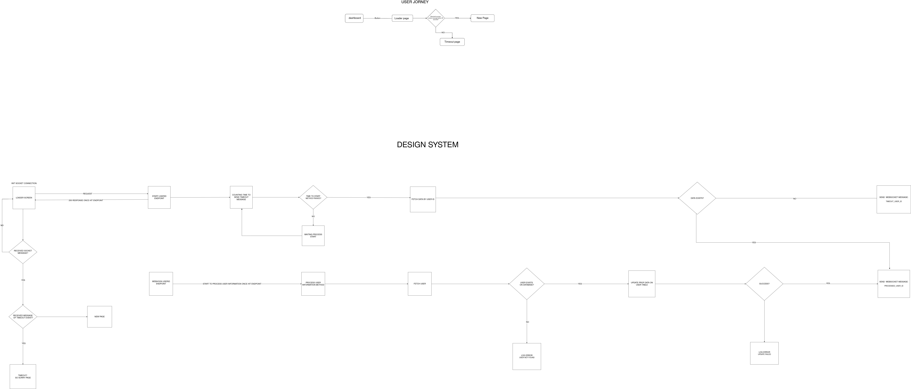

# Web Socket POC

## Description

This repository contains a Proof of Concept (POC) for a Web Socket implementation. The project demonstrates how Web Sockets can be used for real-time communication between a client and server.

## Diagram

Below is a diagram representing the architecture and flow of the Web Socket communication:

